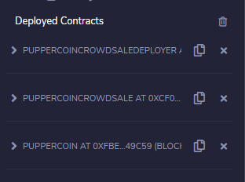
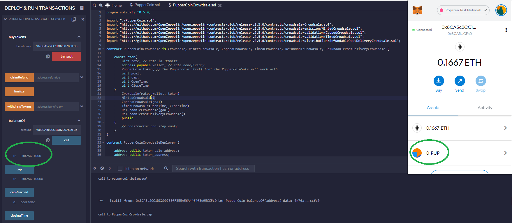
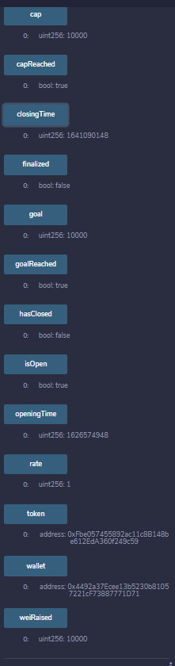

# Unit 21: You sure can attract a crowd! (Advanced Solidity)

_People in Concert - Photo by [Josh Sorenson](https://www.pexels.com/@joshsorenson?utm_content=attributionCopyText&utm_medium=referral&utm_source=pexels) | [Free License](https://www.pexels.com/license/)_

## Background

Your company has decided to crowdsale their PupperCoin token in order to help fund the network development.
This network will be used to track dog breeding activity across the globe in a decentralized way, and allow humans to track the genetic trail of their pets. You have already worked with the necessary legal bodies and obtained the green light on creating a crowdsale open to the public. However, you are required to enable refunds if the crowdsale is successful and the goal is met, and you are only allowed to raise a maximum of 300 ether. The crowdsale will run for 24 weeks.

You will need to create an ERC20 token that will be minted through a `Crowdsale` contract that you can leverage from the OpenZeppelin Solidity library.

This crowdsale contract will manage the entire process, allowing users to send ETH and get back PUP (PupperCoin).
This contract will mint the tokens automatically and distribute them to buyers in one transaction.

It will need to inherit `Crowdsale`, `CappedCrowdsale`, `TimedCrowdsale`, `RefundableCrowdsale`, and `MintedCrowdsale`.

You will conduct the crowdsale on the Kovan or Ropsten testnet in order to get a real-world pre-production test in.

## How to deploy the code

  
PupperCoin code  

  
PupperCoinCrowdSale code  
Compile this code in Remix  
Ropsten testnet was used throughout  

  
Change the contract in the dropdown menu to PupperCoinCrowdsaleDeployer.  
Add in name, symbol and wallet address. This wallet address is the same as the Web3 Metamask address connected to Remix.  
Click transact. This contract will then appear in the 'Deployed Transactions' tab.  

  
Contract deployment seen in Metamask.  

  
Also seen on Etherscan.  

  
Under 'Deployed Contracts', the PupeprCoinCrowdsaleDeployer will be now be listed.  
There is a token_address and token_sale_address.

  
Copy the token_sale_address to the 'At Address' in Remix, and change the contract to PupperCoinCrowdsale. Click 'At Address'.  

  
Copy the token_address to the 'At Address' in Remix, and change the contract to PupperCoin. Click 'At Address'.  

  
Looking under 'Deployed Contracts', there will be 3 contracts deployed now.  

## Deploying and testing transactions  
  
We are now going to make 3 transactions to the PupperCoinCrowdsale contract address.  
Each transaction will originate from 3 separate wallet addresses.  
In this case, the cap and goal is 10000 wei, so 3 separate transactions of 1000, 7000, 2000 wei will be made.  
The green circle shows the 1st wallet address which will be sending 1000 wei to the contract..

  
Sending 1000 wei. As seen in Metamask pop-up.  

  
Made a call using the call function to check the wallet balance. In this case,m in the green circle, 1000 turns up. Which shows 1000 wei has been sent from the wallet to the contract. As the contract has not been finalised yet, then the wallet in Metamask will still show 0 pup.

  
Instead of clicking 'Transact' in Remix for the next transaction, I tried sending a normal ETH transaction via Metamask, from another wallet address to the crowdsale address, in this case trying to send 7000 wei. However Metamask did not allow the transaction to proceed, see the 'NEXT' button which is constantly being greyed out. I reverted to using Remix again for this activity.  

  
Made the 2nd transaction of 7000 wei from another wallet address. Using the same 'Transact' button in Remix.  

  
Transaction seen on Etherscan.
As a reminder:
1st wallet address: Initial Metamask wallet used to connect to Remix via Web 3  
2nd wallet address: Metamask wallet used to send 1000 wei to Crowdsale smart contract address  
3rd wallet address: Metamask wallet used to send 7000 wei to Crowdsale smart contract address  
4th wallet address: Metamask wallet used to send 2000 wei to Crowdsale smart contract address

  
In Remix, it shows 8000 wei raised from the two transactions so far. 1000 wei + 7000 wei.

As the cap was 10000 wei, and we have a total of 8000 wei in the smart contract so far, I tried a transaction of 2050 wei. Which as expected, could not go through.  

  
Fialed transaction as expected, seen in Remix.

  
This is the last transaction.  
2000 wei from antoher wallet address. Which caused the goal and cap to be reached. Successful transaction as seen on Etherscan.

  
Contract cap has been reached.

  
Testing the contract by sending more wei will result in an error as expected.  

  
One error I ran into, was using close time as now += 24 weeks in the inital code. Hence crowdsale smart contract 'isOpen' always returned a 'true' value, which meant we could not finalise the smart contract.  
There were two ways to rectify this.  
1. Using fakenow and a fast forward function, in this case I fastwarded 25 weeks, when the closign time is 24 weeks.  
I was unable to get this method to work though.
2. The second method was to change the close time to now + 10 minutes. More described in the next slide.  

  
Looking at the next slide, the difference in the opening and closing time is 600 seconds. After 10 minutes, the contract closes as is seen by 'isOpen' returns false.

  
The finalisation button on the crowdsale contract can finally be clicked, and the transaction seen on Etherscan.  

  
There were issues adding the PUP token to Metamask, and despite tryign several avenues, I still could not get it to work.  

---------------------------------------------------
## The following part of this readme represents the technical Instructions for completing the task.

### Creating your project

Using Remix, create a file called `PupperCoin.sol` and create a standard `ERC20Mintable` token. Since you're already an expert at this, you can simply use this [starter code](../Starter-Code/PupperCoin.sol).

Create a new contract named `PupperCoinCrowdsale.sol`, and prepare it like a standard crowdsale.

### Designing the contracts

#### ERC20 PupperCoin

You will need to simply use a standard `ERC20Mintable` and `ERC20Detailed` contract, hardcoding `18` as the `decimals` parameter, and leaving the `initial_supply` parameter alone.

You don't need to hardcode the decimals; however, since most use-cases match Ethereum's default, you may do so.

Simply fill in the `PupperCoin.sol` file with this [starter code](../Starter-Code/PupperCoin.sol), which contains the complete contract you'll need to work with in the Crowdsale.

#### PupperCoinCrowdsale

Leverage the [Crowdsale](../Starter-Code/Crowdsale.sol) starter code, saving the file in Remix as `Crowdsale.sol`.

You will need to bootstrap the contract by inheriting the following OpenZeppelin contracts:

* `Crowdsale`

* `MintedCrowdsale`

* `CappedCrowdsale`

* `TimedCrowdsale`

* `RefundablePostDeliveryCrowdsale`

You will need to provide parameters for all of the features of your crowdsale, such as the `name`, `symbol`, `wallet` for fundraising, `goal`, etc. Feel free to configure these parameters to your liking.

You can hardcode a `rate` of 1, to maintain parity with ether units (1 TKN per Ether, or 1 TKNbit per wei). If you'd like to customize your crowdsale rate, follow the [Crowdsale Rate](https://docs.openzeppelin.com/contracts/2.x/crowdsales#crowdsale-rate) calculator on OpenZeppelin's documentation. Essentially, a token (TKN) can be divided into TKNbits just like ether can be divided into wei. When using a `rate` of 1, just like 1000000000000000000 wei is equal to 1 ether, 1000000000000000000 TKNbits is equal to 1 TKN.

Since `RefundablePostDeliveryCrowdsale` inherits the `RefundableCrowdsale` contract, which requires a `goal` parameter, you must call the `RefundableCrowdsale` constructor from your `PupperCoinCrowdsale` constructor, as well as the others. `RefundablePostDeliveryCrowdsale` does not have its own constructor, so just use the `RefundableCrowdsale` constructor that it inherits.

If you forget to call the `RefundableCrowdsale` constructor, the `RefundablePostDeliveryCrowdsale` will fail since it relies on it (it inherits from `RefundableCrowdsale`), and does not have its own constructor.

When passing the `open` and `close` times, use `now` and `now + 24 weeks` to set the times properly from your `PupperCoinCrowdsaleDeployer` contract.

#### PupperCoinCrowdsaleDeployer

In this contract, you will model the deployment based off of the `ArcadeTokenCrowdsaleDeployer` you built previously. Leverage the [OpenZeppelin Crowdsale Documentation](https://docs.openzeppelin.com/contracts/2.x/crowdsales) for an example of a contract deploying another, as well as the starter code provided in [Crowdsale.sol](../Starter-Code/Crowdsale.sol).

### Testing the Crowdsale

Test the crowdsale by sending ether to the crowdsale from a different account (**not** the same account that is raising funds), then once you confirm that the crowdsale works as expected, try to add the token to MyCrypto and test a transaction. You can test the time functionality by replacing `now` with `fakenow`, and creating a setter function to modify `fakenow` to whatever time you want to simulate. You can also set the `close` time to be `now + 5 minutes`, or whatever timeline you'd like to test for a shorter crowdsale.

When sending ether to the contract, make sure you hit the `goal` that you set, and `finalize` the sale using the `Crowdsale`'s `finalize` function. In order to finalize, `isOpen` must return false (`isOpen` comes from `TimedCrowdsale` which checks to see if the `close` time has passed yet). Since the `goal` is 300 ether, you may need to send from multiple accounts. If you run out of prefunded accounts in Ganache, you can create a new workspace.

Remember, the refund feature of `RefundablePostDeliveryCrowdsale` only allows for refunds once the crowdsale is closed **and** the goal is met. See the [OpenZeppelin RefundableCrowdsale](https://docs.openzeppelin.com/contracts/2.x/api/crowdsale#RefundableCrowdsale) documentation for details as to why this logic is used to prevent potential attacks on your token's value.

You can add custom tokens in MyCrypto from the `Add custom token` feature:

You can also do the same for MetaMask. Make sure to purchase higher amounts of tokens in order to see the denomination appear in your wallets as more than a few wei worth.

### Deploying the Crowdsale

Deploy the crowdsale to the Kovan or Ropsten testnet, and store the deployed address for later. Switch MetaMask to your desired network, and use the `Deploy` tab in Remix to deploy your contracts. Take note of the total gas cost, and compare it to how costly it would be in reality. Since you are deploying to a network that you don't have control over, faucets will not likely give out 300 test ether. You can simply reduce the goal when deploying to a testnet to a much smaller amount, like 10,000 wei.

### Submission

Create a Github repo, and a `README.md` file explaining the process for purchasing PupperCoin (or whatever name you came up with).

Also, please provide screenshots to illustrate the functionality (e.g. how you send Ether to the contract, how you add the token to MyCrypto and test a transaction, and how you test the time functionality etc.). Alternatively, you can also record your interactions with the contract as a gif (e.g. https://www.screentogif.com/)

Ensure that anyone can run the steps and add the token to MyCrypto, or a similar wallet.

Include information such as the token parameters, token name, crowdsale cap, etc.

---

© 2020 Trilogy Education Services, a 2U, Inc. brand. All Rights Reserved.
